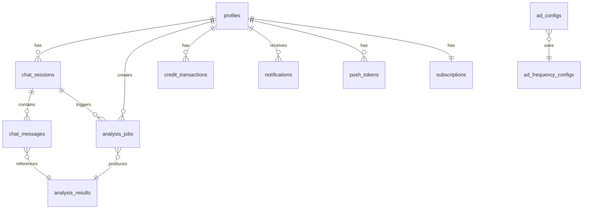

# Backend Structure

> Generated: 2025-12-31
> Based on: implementation-plan.md

## Architecture

- **Pattern**: DDD + Clean Architecture (simplified for NestJS)
- **Framework**: NestJS 10.x
- **ORM**: Prisma 5.x
- **Authentication**: Supabase Auth (JWT verification via Guard)
- **Database**: Supabase PostgreSQL

## Directory Structure

```
apps/backend/
├── prisma/
│   └── schema.prisma           # Prisma schema (matches Supabase tables)
├── src/
│   ├── main.ts                 # Application entry point
│   ├── app.module.ts           # Root module
│   ├── common/                 # Shared utilities
│   │   ├── guards/
│   │   │   └── supabase-auth.guard.ts    # Supabase JWT verification
│   │   ├── decorators/
│   │   │   └── current-user.decorator.ts # Extract user from request
│   │   ├── filters/
│   │   │   └── http-exception.filter.ts  # Global error handling
│   │   ├── interceptors/
│   │   │   └── response.interceptor.ts   # Response wrapping
│   │   └── pipes/
│   │       └── zod-validation.pipe.ts    # Zod schema validation
│   ├── prisma/                 # Prisma module
│   │   ├── prisma.module.ts
│   │   └── prisma.service.ts
│   └── modules/
│       ├── auth/               # User profile management
│       ├── chat/               # Chat sessions & messages
│       ├── analysis/           # Video analysis jobs & results
│       ├── credits/            # Credit balance & transactions
│       ├── ads/                # Ad configuration & events
│       └── notifications/      # Push notifications
├── test/
│   └── jest-e2e.json
├── package.json
├── tsconfig.json
├── nest-cli.json
└── .env.example
```

## Module Structure

| Module | Role | Key Files |
|--------|------|-----------|
| **auth** | User profile (no login - Supabase handles) | `auth.controller.ts`, `auth.service.ts` |
| **chat** | Chat sessions & messages CRUD | `chat.controller.ts`, `chat.service.ts` |
| **analysis** | Video analysis jobs & results | `analysis.controller.ts`, `analysis.service.ts` |
| **credits** | Credit balance & transactions | `credits.controller.ts`, `credits.service.ts` |
| **ads** | Ad config & event logging | `ads.controller.ts`, `ads.service.ts` |
| **notifications** | Push tokens & notifications | `notifications.controller.ts`, `notifications.service.ts` |

## Entity Relationships



## API Endpoints

### Auth (`/api/v1/auth`)

| Method | Path | Auth | Description |
|--------|------|:----:|-------------|
| GET | `/me` | Yes | Get current user profile |
| PATCH | `/me` | Yes | Update profile (name, language, notifications) |

### Chat (`/api/v1/chat`)

| Method | Path | Auth | Description |
|--------|------|:----:|-------------|
| GET | `/sessions` | Yes | List chat sessions (paginated) |
| POST | `/sessions` | Yes | Create new session |
| GET | `/sessions/:id` | Yes | Get session with messages |
| PATCH | `/sessions/:id` | Yes | Update session title |
| DELETE | `/sessions/:id` | Yes | Delete session |
| POST | `/sessions/:id/messages` | Yes | Send message |

### Analysis (`/api/v1/analysis`)

| Method | Path | Auth | Description |
|--------|------|:----:|-------------|
| POST | `/standard` | Yes | Start standard analysis |
| GET | `/:id` | Yes | Get analysis result |
| GET | `/jobs/:id` | Yes | Get job status |
| GET | `/jobs` | Yes | List analysis jobs (paginated) |
| GET | `/video/:videoId` | Yes | Get analysis by video ID |

### Credits (`/api/v1/credits`)

| Method | Path | Auth | Description |
|--------|------|:----:|-------------|
| GET | `/` | Yes | Get credit balance |
| GET | `/transactions` | Yes | Get transaction history (paginated) |

### Ads (`/api/v1/ads`)

| Method | Path | Auth | Description |
|--------|------|:----:|-------------|
| GET | `/config` | No* | Get ad config by platform |
| POST | `/events` | No* | Log ad event |

*Optional: If `x-user-id` header is present, will check user's premium status.

### Notifications (`/api/v1/notifications`)

| Method | Path | Auth | Description |
|--------|------|:----:|-------------|
| GET | `/` | Yes | List notifications (paginated) |
| PATCH | `/:id/read` | Yes | Mark as read |
| POST | `/read-all` | Yes | Mark all as read |
| POST | `/push-token` | Yes | Register push token |
| DELETE | `/push-token/:token` | Yes | Unregister push token |

## Response Format

All responses follow the `@glint/types` ApiResponse format:

```typescript
// Success
{
  "success": true,
  "data": { ... },
  "meta": { "page": 1, "limit": 20, "total": 100, "hasMore": true }
}

// Error
{
  "success": false,
  "error": {
    "code": "ERR_001",
    "message": "Validation failed",
    "details": { "errors": [...] }
  }
}
```

## Authentication Flow

1. Client authenticates with Supabase (login/signup handled by Supabase SDK)
2. Client gets JWT access token from Supabase
3. Client sends requests with `Authorization: Bearer <token>`
4. `SupabaseAuthGuard` verifies token using Supabase Admin API
5. Verified user is attached to request object
6. `@CurrentUserId()` decorator extracts user ID in controllers

```typescript
// Guard implementation (simplified)
const { data: { user }, error } = await supabase.auth.getUser(token);
if (error || !user) throw new UnauthorizedException();
request.user = user;
```

## Environment Variables

| Key | Description | Required |
|-----|-------------|:--------:|
| `DATABASE_URL` | Supabase PostgreSQL connection string | Yes |
| `SUPABASE_URL` | Supabase project URL | Yes |
| `SUPABASE_SERVICE_ROLE_KEY` | Supabase service role key (admin) | Yes |
| `PORT` | Server port (default: 4000) | No |
| `NODE_ENV` | Environment (development/production) | No |
| `CORS_ORIGINS` | Comma-separated allowed origins | No |

## How to Run

### Prerequisites

- Node.js 20+
- pnpm
- Supabase project with migrations applied

### Development

```bash
# Navigate to backend
cd apps/backend

# Install dependencies
pnpm install

# Generate Prisma client
pnpm prisma generate

# Create .env.local from .env.example
cp .env.example .env.local
# Edit .env.local with your Supabase credentials

# Run development server
pnpm start:dev
```

### Prisma Commands

```bash
# Generate client after schema changes
pnpm prisma generate

# Push schema to database (development)
pnpm prisma db push

# Create migration
pnpm prisma migrate dev --name your_migration_name

# Deploy migrations (production)
pnpm prisma migrate deploy

# Open Prisma Studio
pnpm prisma studio
```

### Testing

```bash
# Unit tests
pnpm test

# Watch mode
pnpm test:watch

# Coverage
pnpm test:cov

# E2E tests
pnpm test:e2e
```

### Production Build

```bash
pnpm build
pnpm start:prod
```

## Key Implementation Details

### 1. Supabase Auth Integration

- Uses `@supabase/supabase-js` with service role key for server-side verification
- No signup/login endpoints - handled entirely by Supabase client SDKs
- Profile is auto-created via database trigger when user signs up

### 2. Credit System

- Uses database functions for atomic operations (`deduct_credits`, `refund_credits`)
- Credit transactions are logged with references to related entities
- Refunds automatically triggered on failed analysis jobs

### 3. Analysis Flow

1. Client submits YouTube URL
2. Backend validates URL, checks limits and credits
3. Creates `analysis_job` with PENDING status
4. Deducts credits
5. Returns job ID for polling
6. (Worker processes job asynchronously - separate service)
7. Job status updated to COMPLETED/FAILED

### 4. Ad System

- Configuration fetched per platform (web/ios/android)
- `should_show_ads()` database function checks user plan and temporary premium
- Rewarded ads grant temporary premium access via `grant_ad_reward()` function

## Important Notes

- **No TypeORM**: Uses Prisma exclusively
- **No custom auth**: Relies on Supabase Auth
- **Database functions**: Critical operations use PostgreSQL functions for atomicity
- **Shared types**: Uses `@glint/types` and `@glint/validators` packages
- **API versioning**: All routes under `/api/v1/`

## Dependencies on Other Services

- **Supabase**: Auth, Database, RLS policies
- **Python Worker**: Processes analysis jobs (not implemented in this backend)
- **Web/Mobile Apps**: Consume this API
